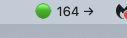

# Dexcom G7 macOS Menubar App

<div align="center">

🩺 **A lightweight macOS menubar app for monitoring Dexcom G7 glucose readings in real-time**

[](https://opensource.org/licenses/MIT)
[](https://www.python.org/downloads/)
[](https://www.apple.com/macos/)

</div>

---

A simple yet powerful macOS menubar application that displays your Dexcom G7 CGM (Continuous Glucose Monitor) readings in real-time. Features color-coded glucose indicators, trend arrows, smart notifications, and automatic updates every 5 minutes.

Perfect for people with diabetes who want quick access to their glucose data without opening the Dexcom app!



## Features

- **Live Glucose Display**: Shows current glucose value and trend arrow in the menubar
- **Color-Coded Status**: Visual indicators for glucose ranges
  - 🔴 Red: Below 70 (Low)
  - 🟢 Green: 70-180 (In Range)
  - 🟠 Orange: 180-250 (High)
  - 🟡 Yellow: Above 250 (Very High)
- **Auto-Updates**: Automatically fetches new readings every 5 minutes
- **Recent History**: View up to 12 recent glucose readings in the dropdown menu
- **Secure Storage**: Credentials stored securely in macOS Keychain
- **Trend Arrows**: Visual indicators for glucose trends (⬆⬆, ⬆, ↗, →, ↘, ⬇, ⬇⬇)
- **Smart Notifications**: Get alerts for both low and high glucose
  - **Low alerts**: SingleDown (⬇) below 130 mg/dL or DoubleDown (⬇⬇) below 160 mg/dL
  - **High alerts**: FortyFiveUp (↗) above 200 mg/dL or any reading above 250 mg/dL
  - Notifications throttled to avoid spam (15 minute cooldown per alert type)
- **Manual Refresh**: Force refresh on demand
- **Error Handling**: Robust error handling with clear status messages

## Quick Start

```bash
# Clone the repository
git clone https://github.com/YOUR_USERNAME/dexcom-menubar-app.git
cd dexcom-menubar-app

# Set up virtual environment and install dependencies
python3 -m venv venv
source venv/bin/activate
pip install -r requirements.txt

# Configure your Dexcom Share credentials
./setup-credentials.sh

# Run the app
python -m dexcom_menubar.app

# (Optional) Install as auto-start app
./install-launch-agent.sh
```

That's it! Your glucose readings will now appear in your menubar. 🎉

## Prerequisites

- macOS 10.10 or later
- Python 3.8 or later
- Dexcom G7 or G6 with Share enabled
- Active Dexcom Share account

## Installation

### 1. Clone the Repository

```bash
git clone https://github.com/hsaraiya5/dexcom-menubar-app.git
cd dexcom-menubar-app
```

### 2. Create Virtual Environment

```bash
python3 -m venv venv
source venv/bin/activate
```

### 3. Install Dependencies

```bash
pip install -r requirements.txt
```

Or install the package:

```bash
pip install -e .
```

## Setup

### Enable Dexcom Share

1. Open the Dexcom G7 app on your phone
2. Go to Settings → Share
3. Enable Share
4. Create or use existing Dexcom Share credentials

### Configure Credentials

You have three options for storing credentials:

#### Option 1: Interactive Setup Script (Recommended)

Run the interactive setup script which will test your credentials and save them to macOS Keychain:

```bash
./setup-credentials.sh

# Or directly
python -m dexcom_menubar.setup
```

This will:
- Prompt you for your username and password in the terminal
- Test the credentials with Dexcom's API
- Save them securely to macOS Keychain if successful

#### Option 2: Environment Variables

Create a `.env` file:

```bash
cp .env.example .env
```

Edit `.env` with your credentials:

```
DEXCOM_USERNAME=your_username
DEXCOM_PASSWORD=your_password
DEXCOM_REGION=US  # Use 'OUS' for Outside US
```

Then load environment variables:

```bash
source .env  # For bash/zsh
```

## Usage

### Running the App

```bash
# If you installed with pip
dexcom-menubar

# Or run directly
python -m dexcom_menubar.app
```

### Keeping the App Running

To run the app in the background:

```bash
nohup python -m dexcom_menubar.app &
```

Or create a Launch Agent (see instructions below).

### Menu Options

- **Current Reading**: Shows the latest glucose value, trend, and update time
- **Recent Readings**: List of the last 12 readings with timestamps
- **Refresh Now**: Manually fetch the latest reading
- **Settings**: Update or clear stored credentials
- **Quit**: Exit the application

## Auto-Start on Login (Recommended)

The easiest way to have the app start automatically when you log in is to use the provided installation script:

```bash
./install-launch-agent.sh
```

This script will:
- Create a macOS Launch Agent
- Configure it to start on login
- Set up automatic restart if the app crashes

To uninstall:

```bash
./uninstall-launch-agent.sh
```

### Manual Launch Agent Setup

If you prefer to create the launch agent manually, see the example in `install-launch-agent.sh`. The script automatically detects your project directory and creates the appropriate configuration.

## Troubleshooting

### Authentication Errors

- Verify your Dexcom Share credentials
- Ensure Share is enabled in the Dexcom G7 app
- Check that you selected the correct region (US vs Outside US)
- Try logging into the Dexcom Share website to verify credentials

### No Data Available

- Make sure your Dexcom G7 is transmitting to your phone
- Verify that Share is actively uploading data
- Check your internet connection
- Try the "Refresh Now" option

### App Won't Start

- Ensure all dependencies are installed: `pip install -r requirements.txt`
- Check Python version: `python --version` (needs 3.8+)
- Look at logs in `~/Library/Application Support/DexcomMenubar/dexcom_menubar.log`

### Keychain Access Issues

If you have trouble with keychain storage:

1. Open Keychain Access app
2. Search for "DexcomMenubar"
3. Delete any existing entries
4. Restart the app and re-enter credentials

Or use environment variables instead.

## Security Notes

- Credentials stored in macOS Keychain are encrypted
- Never commit `.env` file with credentials to version control
- The app only communicates with official Dexcom Share API endpoints
- API uses HTTPS for all communications

## API Rate Limits

- Default update interval: 5 minutes
- Dexcom Share API updates approximately every 5 minutes
- Manual refresh is available but limited by API rate limits

## Notifications

The app sends macOS notifications to help you manage both high and low glucose:

### Low Glucose Alerts (⚠️)
- **SingleDown (⬇)**: When glucose is below 130 mg/dL and falling
- **DoubleDown (⬇⬇)**: When glucose is below 160 mg/dL and dropping quickly

### High Glucose Alerts (📈)
- **FortyFiveUp (↗)**: When glucose is above 200 mg/dL and rising
- **Elevated**: When glucose is above 250 mg/dL (any trend)

**Smart Throttling**: To prevent notification spam, the app won't send duplicate alerts for the same condition within 15 minutes. This gives you time to take action without being overwhelmed. Each alert type is tracked separately, so you can receive both high and low alerts if conditions change.

**Notification Permissions**: Make sure notification permissions are enabled for the app in System Preferences → Notifications.

## Glucose Ranges

The app uses color-coded indicators to show your glucose status at a glance:

- **🔴 Red (Below 70 mg/dL)**: Low blood sugar (hypoglycemia) - requires immediate attention
- **🟢 Green (70-180 mg/dL)**: In target range - optimal glucose level
- **🟠 Orange (180-250 mg/dL)**: High blood sugar - may need correction
- **🟡 Yellow (Above 250 mg/dL)**: Very high blood sugar - requires attention

These ranges are general guidelines. Consult with your healthcare provider for your personal target ranges.

## Trend Arrows

- ⬆⬆ Double Up: Rising quickly (>2 mg/dL/min)
- ⬆ Single Up: Rising (1-2 mg/dL/min)
- ↗ Forty-Five Up: Rising slowly (0.5-1 mg/dL/min)
- → Flat: Steady
- ↘ Forty-Five Down: Falling slowly (-0.5 to -1 mg/dL/min)
- ⬇ Single Down: Falling (-1 to -2 mg/dL/min)
- ⬇⬇ Double Down: Falling quickly (<-2 mg/dL/min)
- ⚠ Warning: Data not available or out of range

## Project Structure

```
dexcom-menubar-app/
├── dexcom_menubar/
│   ├── __init__.py           # Package initialization
│   ├── app.py                # Main menubar application
│   ├── dexcom_api.py         # Dexcom Share API client
│   ├── credentials.py        # Secure credential management (Keychain)
│   └── setup.py              # Interactive credential setup script
├── install-launch-agent.sh   # Auto-start installer script
├── uninstall-launch-agent.sh # Auto-start uninstaller script
├── setup-credentials.sh      # Credential configuration script
├── run.sh                    # Simple run script
├── requirements.txt          # Python dependencies
├── setup.py                  # Package installation config
├── .env.example              # Example environment variables template
├── .gitignore                # Git ignore rules
├── LICENSE                   # MIT License
├── README.md                 # This file
└── QUICKSTART.md             # Quick start guide
```

## Dependencies

- **rumps**: macOS menubar app framework
- **requests**: HTTP library for API calls
- **keyring**: Secure credential storage
- **python-dateutil**: Date/time utilities

## Contributing

Contributions are welcome! Please feel free to submit issues or pull requests.

## Disclaimer

This is an unofficial third-party application and is not affiliated with, endorsed by, or supported by Dexcom, Inc. Use at your own risk.

This application is for informational purposes only and should not be used for medical decisions. Always refer to your Dexcom G7 receiver or app for official readings.

## License

MIT License - See LICENSE file for details

## Support

For issues, questions, or feature requests, please open an issue on GitHub.

## Acknowledgments

- Built with [rumps](https://github.com/jaredks/rumps)
- Uses the Dexcom Share API
- Inspired by the diabetes community's need for convenient CGM data access
